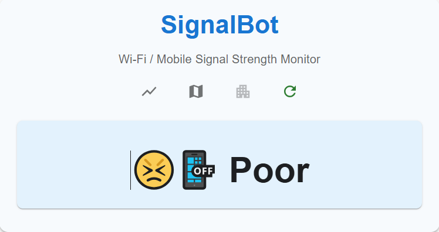
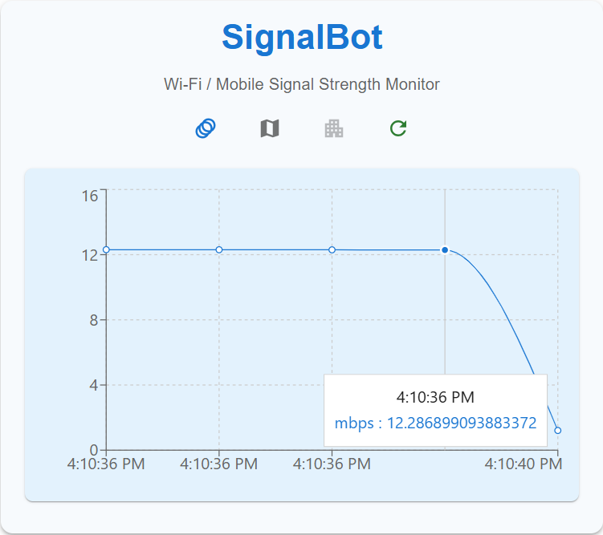
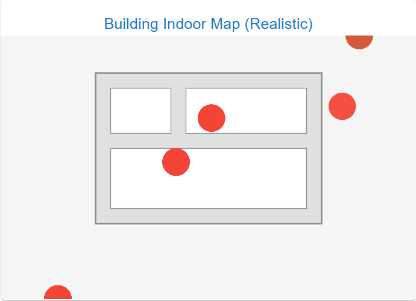
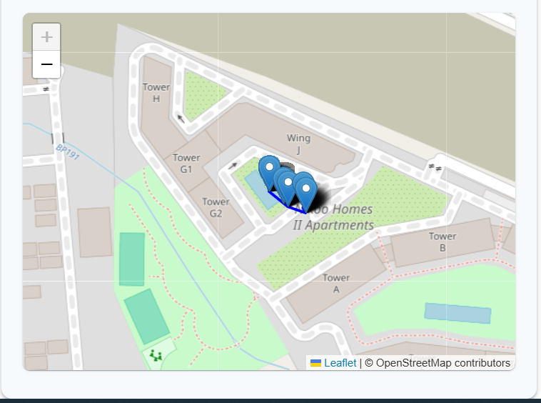

# SignalBot

**SignalBot** is a React web app for visualizing Wi-Fi and mobile signal strength as you move, both indoors and outdoors. It features real-time signal measurement, history graphing, and mapping of your signal trail.

## Features

- 📶 **Live Signal Strength**: Measures and displays your current Wi-Fi/mobile speed.
- 📈 **Graph Mode**: Visualizes your signal history over time.
- 🗺️ **Outdoor Map**: Plots your movement and signal strength on an interactive map.
- 🏢 **Indoor Map**: Visualizes your trail and signal regions on a building floor plan.
- 🟢🔴 **Signal Regions**: Shows green (good) and red (poor) areas based on your signal.

## Screenshots

<p align="center">
  
  
  
  
</p>

## Getting Started

### Prerequisites

- Node.js (v16+ recommended)
- yarn

### Installation

```bash
git clone https://github.com/yourusername/signal-bot.git
cd signal-bot
yarn install
```

### Running the App

```bash
yarn start
```

The app will open at [http://localhost:3000](http://localhost:3000).

## Usage

- Toggle between **Graph** and **Anime** modes.
- Click **Show Map View** to see your trail on the map.
- Click **Show Building Map** for the indoor visualization.
- Click **Recheck Now** to manually measure signal.

## Project Structure

- `src/App.tsx` – Main React component and logic.
- `public/signalbot-logo.svg` – App logo.
- `public/index.html` – HTML template.

## Customization

- Replace `public/signalbot-logo.svg` with your own logo if desired.
- Adjust the indoor map SVG or building bounds in `App.tsx` for your environment.

## License

MIT

---

Made with ❤️ for real-time signal visualization.
